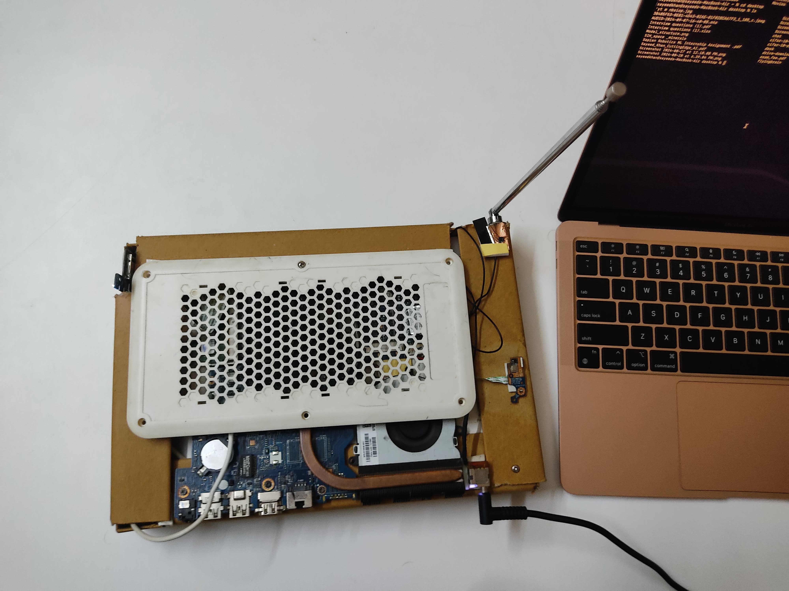

# Welcome to the Future of Tech... or Just Really Old Junk? 🤷‍♂️

Greetings, tech savants and junk enthusiasts alike! Welcome to **cool_shi**—the place where we turn old technology into something that might look like it belongs in a tech museum of bad ideas. If you're here, you're either impressed, confused, or just ready for a laugh. Buckle up and get ready to witness the marvel of hardware recycling.

## Meet the Masterpiece: The Portable Powerhouse 🤯

Ever dreamed of creating something that makes your old tech look like a masterpiece? We did too—except we decided to make it look like it was built by a time traveler from a parallel universe. Presenting the **Portable Powerhouse**, made from:

- **Cardboard Casings**: That’s right, we ditched the plastic and went green with recycled cardboard. Who needs durability when you’ve got eco-friendly vibes? The plastic laptop body? It’s history. We threw it out with a ceremonious laugh. 😂
- **RAM**: 8 GB—enough to keep Linux happier than a kid in a candy store. It’s like pretending this ancient beast can handle modern tasks without breaking a sweat. Who needs more when you can dream about running that beloved 2010-era software?
- **Storage**: 1240 GB—because more storage means more space for your cherished junk files and retro nostalgia. The more the merrier, right?
- **Processor**: A ten-year-old i3. Think of it as the tech equivalent of slapping a turbo on a tricycle. Expect groundbreaking performance... in a parallel universe.
- **Custom Cooling System**: Constructed from a laptop stand and an embarrassing amount of duct tape. This cooling system is cooler than the other side of the pillow—if you enjoy the thrill of it possibly collapsing mid-operation.
- **Custom Network Channel**: Repurposed from an old radio. Because why not turn vintage noise into data chaos? It’s the ideal way to get your data to the "cloud"—by which we mean an area full of static and interference.

## Why This Beast Runs Linux 🐧

Why? Because Linux is so zen that it’s perfectly content running on this glorious mess of hardware. It’s like Linux and this machine are old friends who meet up once in a while to reminisce about the good old days. With this setup, Linux can do what it does best: handle outdated tech with a serene grace.

## The Art of Creation: Disassemble, Reassemble, and Laugh 🔧

Here’s a peek into the creative process behind this masterpiece:

1. **Cardboard Craze**: We started with a perfectly good laptop, stripped off the plastic, and wrapped the whole thing in eco-friendly cardboard. Talk about going green—or at least pretending to.
2. **Cooling Shenanigans**: Turned a laptop stand and some questionable engineering into a cooling system that’s as unreliable as it is ingenious.
3. **Radio Woes**: Crafted a network channel from an old radio. It’s not exactly high-tech, but it sure makes for a good story.

## Why This Is the Pinnacle of Tech Innovation (Or Not) 🎉

This project stands as a testament to what happens when you mix creativity with a disregard for traditional tech conventions. It’s a bold showcase of my hardware skills—one where risks were taken, a perfectly functional laptop was sacrificed, and everything was done with a sense of humor.

## Witness the Magic!

Check out the madness, marvel at the chaos, and maybe get inspired to try your hand at some inventive tech disasters. This is **cool_shi**, where the only thing cooler than the tech is the audacity behind it.

---

_Think you can top this glorious wreck? Show us what you’ve got. Until then, enjoy the show and keep on innovating—or at least keep breaking things in the name of creativity._